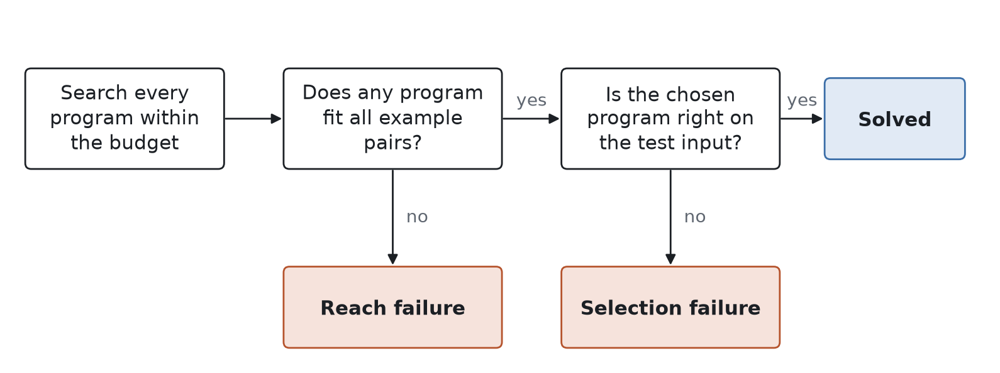
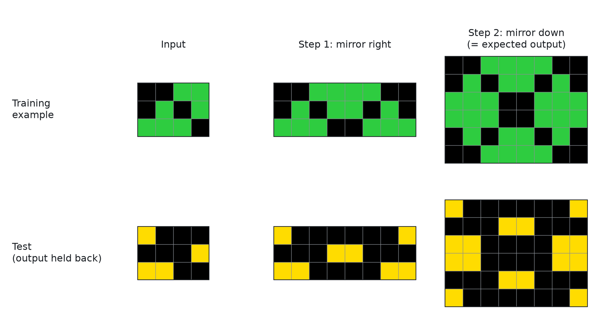
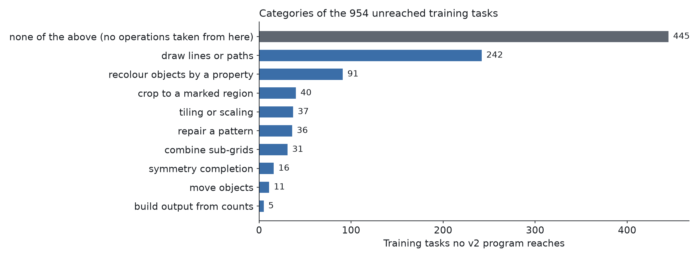
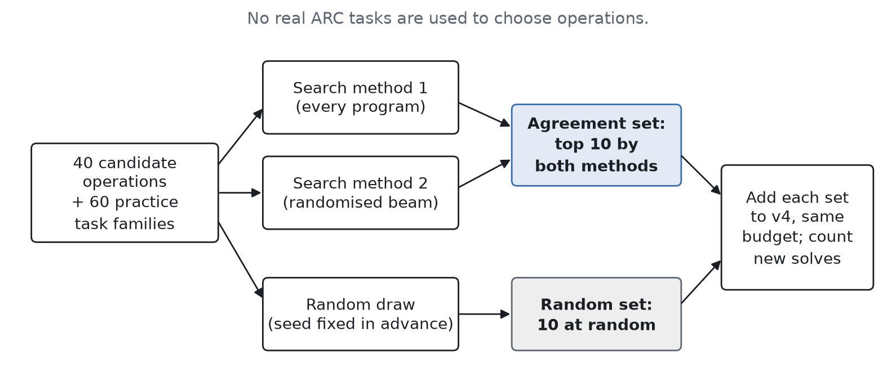
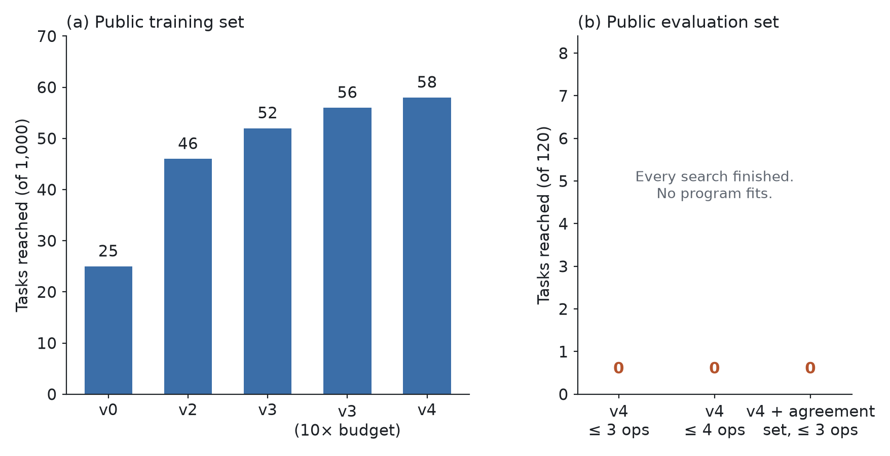
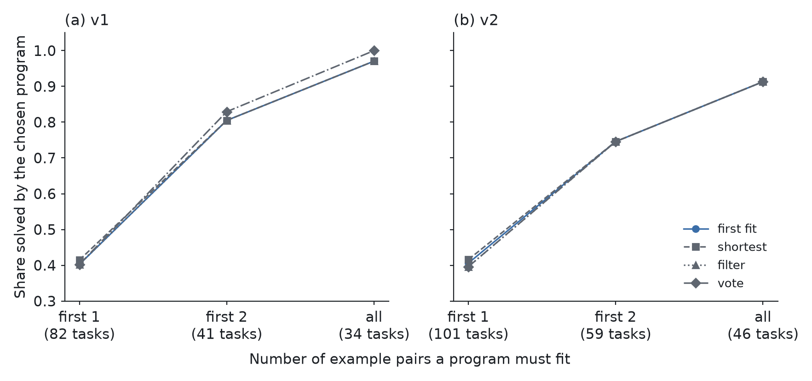
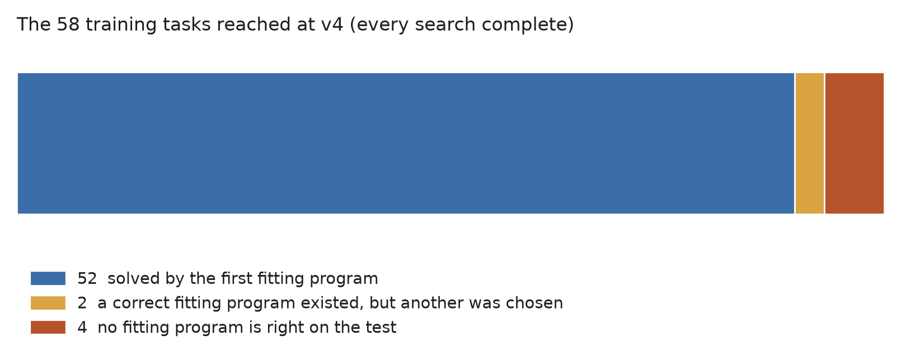
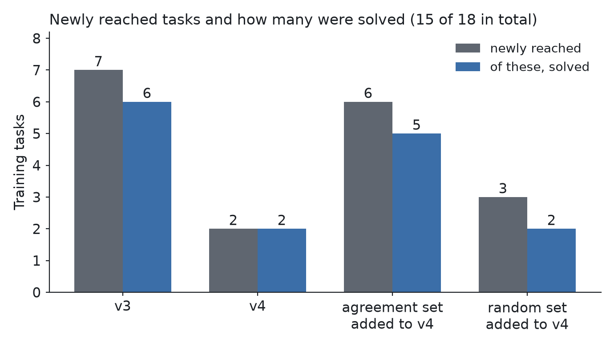

**Linked entry:** Kaggle notebook `tpd-arc2-entry`, submission 55910824, leaderboard score 0.00.
**Code, data, plans and decision log:** github.com/digitaldrreamer/reach-not-selection (MIT-0).

## Abstract

We study a simple ARC-AGI-2 solver that searches for programs. We measure why it fails.

A failed task has one of two causes. In a **reach failure**, no program the solver can build fits the task. In a **selection failure**, a correct program exists, but the solver picks a different one. The two causes need different fixes, so we measured both. Before each run, we wrote down its settings and what each possible result would mean. Section 6 lists the places where this did not hold.

Reach is what limits this solver. On the 120 public evaluation tasks, we searched every program of up to 4 operations. Each task had up to 80 operations available, so this is up to about 41.5 million programs per task. No program fit any task. Our Kaggle entry scored 0.00, as we predicted before submitting.

On the public training set the solver does reach some tasks. At stage v4 it reaches 58. For 52 of them, the first program found also solves the test. A perfect choosing rule could add at most 2 more. We added new operations in four planned tests. The new operations reached 18 tasks and solved 15 of them (15 tasks and 13 solved, counting each task once). In one comparison, operations chosen by two search methods together solved 5 new tasks, and operations chosen at random solved 3.

## 1. Introduction

An ARC-AGI-2 task shows a few example pairs of coloured grids. Each pair has an input grid and its output grid. A solver must find the rule and apply it to a new test input. People find these tasks easy. Current AI systems find them hard. The competition scores each entry on a hidden set of tasks.

One kind of solver searches for programs. It builds programs from a fixed list of grid operations. We call this list its **vocabulary**. Examples of operations are "rotate", "mirror" and "recolour the largest object". The solver keeps every program that turns each example input into its example output. Each answer comes with the program that made it, so you can see how the solver got it.

When this kind of solver scores 0.00, two different things could be wrong:

- No correct program can be built from the vocabulary. Then the solver needs new operations, or longer programs.
- A correct program can be built, but the solver submits another program that also matches the examples. Then the solver needs a better way to choose.

This paper measures which of the two causes the failures of one real solver on ARC-AGI-2. Many program-search solvers add extra steps for choosing, such as filters or voting. These steps only help if the solver picks the wrong program. We wanted to know this before building them.

**Contributions.**

1. We split solver failures into reach failures and selection failures, and count both exactly.
2. On the public evaluation set, we searched every program of up to 4 operations and reached no task. Going from 3 to 4 operations added no reached task.
3. On the training set, a better choosing rule could add at most 2 tasks, and most tasks that new operations reached were solved.
4. In one planned comparison, the way new operations were chosen changed how many tasks they solved.
5. We publish everything: code, result files, plans, and a dated log of every run and correction.

## 2. Prior work

**Program search with a fixed vocabulary.** The winner of the 2020 Kaggle ARC competition (icecuber) searched chains of grid operations up to a fixed length [1]. Hodel's arc-dsl is a public library of ARC operations [2]. Part of our vocabulary rewrites some of its operations in our own code. Our solver is of this kind. We kept it small and simple on purpose, because our goal is to measure. A fixed search order lets us count reach and selection exactly.

**Program search without a hand-built vocabulary.** SOAR, second among the 2025 papers, trains a language model on records of its own program searches. It needs no hand-written vocabulary [3, 4]. Pang's evolutionary method builds a library of reusable program parts while it searches [4]. In our terms, both methods work on reach. We did not test them.

**Learning-based methods.** NVARC had the top Kaggle score in 2025: 24% on the private ARC-AGI-2 set. It used large amounts of generated data and models that keep training at test time [4]. TRM and CompressARC, first and third among the 2025 papers, solve tasks with very small neural networks [4]. These systems have no visible vocabulary. Splitting their failures into reach and selection does not apply to them directly (Section 8).

**What is new here.** We know of no earlier ARC work that does three things. It counts reach and selection separately for one solver. It searches every program up to a length to test whether longer programs would help. It writes down the plan for each run before the run. The closest earlier work is the library-building methods above, because our last test asks where new operations should come from.

## 3. Approach

### 3.1 The solver

A Rust program lists every **chain** of grid operations. Each operation takes a grid and returns a grid. A program applies its operations one after another. The search tries shorter programs first, in a fixed order. It stops at 3 operations unless a run says otherwise. Because the order is fixed, the first program that fits is always the same program.

The paper uses four terms:

- A program **fits** a task when it turns every example input into exactly the example output.
- A task is **reached** when at least one program that fits is found within the search budget (Section 3.5).
- A **choosing rule** picks one fitting program to submit.
- A reached task is **solved** when the chosen program also gives the correct output for the test input.

Figure 1 shows how every task ends up solved, or as one of the two kinds of failure.

Figure 2 shows a real training task and the first program that fits it.

### 3.2 The vocabulary in five stages

The vocabulary grows in five stages, v0 to v4. The number of operations differs from task to task, because some operations are built from each task's own colours.

| Stage | Operations | Per task |
|---|---|---|
| v0 | 12 whole-grid operations: three rotations, two mirror images, swapping rows and columns, joining a grid to its mirror image (two ways), cropping to the non-empty area, trimming the border, doubling the size, swapping the two main colours | 12 |
| v1 | A separate set taken from arc-dsl: rotations, mirrors, halves, trimming, scaling, and recolourings built from the task's colours | up to 50 |
| v2 | v1 plus 10 object operations: keep or remove the largest or smallest object, crop to the largest object, fill holes, and slide cells towards each of the four edges | up to 60 |
| v3 | v2 plus 10 operations chosen from categories of unreached tasks (Section 3.3) | up to 70 |
| v4 | v3 plus 10 more operations chosen the same way | up to 80 |

We first ran v0, v1 and v2 as exploration. Before we cited any of their numbers, we ran all three again under a plan written in advance. We got exactly the same results. We planned v3 and v4 in advance from the start.

### 3.3 How v3 and v4 chose their operations

We wrote the rule for choosing new operations before we looked at any unsolved task. The rule has three steps.

1. **Sort.** No v2 program reaches 954 training tasks. Written rules gave each of them one label from a fixed list of ten categories. The rules looked only at the example pairs. Figure 3 shows the counts. A catch-all category held 445 tasks the rules could not place. The plan did not allow new operations based on that category.
2. **Choose.** Each stage adds at most 10 general operations, spread over the largest categories.
3. **Fix, then measure.** We wrote down exactly what each new operation does before running the stage.

v3 added operations such as joining same-coloured cells with lines, extending line segments, tiling a grid 2 by 2, and combining two sub-grids cell by cell. v4 added scaling by 2 and by 3, rays from single cells, diagonal lines, outlines, and more ways to combine sub-grids. The repository has the exact definitions.

### 3.4 Four choosing rules

We wrote down four choosing rules before we compared them.

- The **first-fit rule** submits the first fitting program in the search order.
- The **shortest rule** submits the shortest fitting program. Ties are broken with a fixed random seed.
- The **filter rule** works like the shortest rule, but first removes trivial programs. A program is trivial if it leaves every input grid unchanged, or turns every input into a grid of a single colour.
- The **vote rule** works like the filter rule. It then groups the remaining programs by the output they give for the test input, and takes the shortest program in the largest group. Solvers are given the test input, so this uses no hidden information.

Each rule after the first adds more steps for choosing. If wrong choices caused many failures, these rules should do better than the first-fit rule.

### 3.5 Budgets

Each search has a budget of steps. One step applies one operation to all of a task's example inputs.

- v0 had no budget. It checked every program of up to 3 operations.
- v1, v2 and v3 had 100,000 steps per task. We also ran v3 again with 1 million steps, to see what the larger budget alone adds.
- v4 had 1 million steps per task. This is enough to check every program of up to 3 operations.
- The length-4 run on the evaluation set had 100 million steps per task, enough to check every program of up to 4 operations.

When a search runs out of budget, it shows only that no program was found yet. Counts from such searches are lower bounds: the true count could be higher. We report every search that ran out of budget.

### 3.6 Where new operations come from

Our last test asks whether the way operations are chosen matters. We built a pool of 40 candidate operations. We also generated 60 families of practice tasks. A family is a group of tasks made by the same rule. No real ARC tasks were used. Two search methods solved the practice tasks:

- The first tries every program, shortest first.
- The second is a randomised beam search. At each step it keeps only the most promising unfinished programs.

Each method gave a ranking of how much its solutions used each candidate operation. Figure 4 shows the design.

- The **agreement set** is the 10 operations ranked highest by both methods together.
- The **random set** is 10 operations drawn at random from the same pool, using a random seed fixed in advance.

We added each set to v4 and ran it on the training set. Both runs used the same budget and the same measure. Before the runs, we wrote down what each possible result would mean. The two sets share 3 operations. This makes them more alike, so a difference between them is harder to find.

### 3.7 Records

Every result file is written once. A dated log records each run, each correction and each cancelled rule, in order. It also records each result file's hash, a short code computed from the file's contents. The solver we ran on Kaggle gives exactly the same output as our measured run on all 120 evaluation tasks, byte for byte. We checked this by building it on Linux and comparing the two outputs.

## 4. Results: leaderboard and public evaluation set

### 4.1 Leaderboard

Our linked entry uses the v4 vocabulary plus the agreement set, the first-fit rule, and two attempts per task. Before submitting, we predicted a score of 0.00 from the evaluation results below. The entry scored **0.00**. An earlier entry with the v4 vocabulary alone also scored 0.00.

### 4.2 Public evaluation set

| Run | Program length | Did every search finish? | Tasks reached (of 120) |
|---|---|---|---|
| v2 | up to 3 | no: 110 ran out of budget | 0 |
| v3 | up to 3 | not recorded | 0 |
| v4 | up to 3 | yes | 0 |
| v4 | up to 4 | yes (up to about 41.5 million programs per task) | 0 |
| v4 plus agreement set | up to 3 | yes | 0 |

We ran v2, v3 and v4 on the evaluation set once each. None reached a single task. At v4 every search finished, so this zero is exact: no program of up to 3 operations fits any evaluation task.

Two explanations were left. The needed programs might be longer than 3 operations. Or the vocabulary might lack the needed operations. A separate planned run tested this by searching every program of up to 4 operations. Before the run, we filed a note saying what each result would mean. Zero fits would mean the vocabulary lacks the needed kinds of operations. Any fit would mean program length was the limit. The run found zero fits.

No program we searched is correct on any public evaluation task. So no choosing rule can help on these tasks. The evaluation tasks need **kinds of operations this vocabulary does not have**. Programs of up to 4 of the existing operations do not reach these tasks. The leaderboard uses a hidden set that we cannot inspect, but the score of 0.00 is what the public evaluation results predict.

## 5. Analysis on the training set

No program fits any evaluation task, so the evaluation set gives nothing more to study. To see how the solver succeeds and fails, we ran it on the 1,000 public training tasks. These numbers describe the solver's behaviour. They are not scores on the evaluation set.

### 5.1 Selection rarely fails

At v0, the solver reaches 25 tasks, and the first fitting program solves all 25.

We compared the four choosing rules at v1 and v2. Programs had to fit the first example pair, the first two pairs, or all pairs. The table and Figure 6 show the share of tasks where the chosen program solves the test.

| Stage | Pairs the program must fit | Tasks with a fitting program | First fit | Shortest | Filter | Vote |
|---|---|---|---|---|---|---|
| v1 | first 1 | 82 | 0.402 | 0.415 | 0.402 | 0.402 |
| v1 | first 2 | 41 | 0.805 | 0.805 | 0.805 | 0.829 |
| v1 | all | 34 | 0.971 | 0.971 | 0.971 | 1.000 |
| v2 | first 1 | 101 | 0.406 | 0.416 | 0.396 | 0.396 |
| v2 | first 2 | 59 | 0.746 | 0.746 | 0.746 | 0.746 |
| v2 | all | 46 | 0.913 | 0.913 | 0.913 | 0.913 |

A real solver uses all example pairs. With all pairs, the four rules score the same at v2. At v1, the vote rule helps on one of 34 tasks. With only one pair, many wrong programs fit by chance, and every rule does poorly. The rules then differ by one or two tasks. Many v1 and v2 searches ran out of budget, so these comparisons do not see every fitting program.

The most reliable measurement is at v4, because every search finished. The solver reaches 58 tasks, and the first fitting program solves 52. Of the other 6 tasks, only 2 have any fitting program that solves the test. In the other 4, every fitting program is wrong on the test. So a perfect choosing rule could add at most 2 tasks (Figure 7).

### 5.2 Most newly reached tasks are solved

If choosing works well, most tasks that new operations reach for the first time should be solved. We tested this four times. Each test had its own plan, written in advance.

| Test | Newly reached | Of these, solved |
|---|---|---|
| v3 | 7 | 6 |
| v4 | 2 | 2 |
| agreement set added to v4 | 6 | 5 |
| random set added to v4 | 3 | 2 |
| **All four** | **18** | **15** |

The random set's 3 newly reached tasks are also among the agreement set's 6. Counting each task once, the four tests reach 15 and solve 13.

Before the runs, we set two targets for v3 and v4: at least 5 newly reached tasks per stage, and at least 0.75 of them solved. v3 met both targets (7 tasks, 0.857 solved). v4 met the second target (2 of 2 solved) but reached only 2 new tasks.

On the training set, reach grew as follows: 25 tasks at v0, 46 at v2, 52 at v3, 56 at v3 with the larger budget, and 58 at v4. v3 also lost one task that v2 had solved. The larger v3 vocabulary used up the same budget faster. The v3 rerun with 1 million steps solved it again, and so did v4. v4 and both sets lost no solved task.

### 5.3 The way operations are chosen made a difference

We added the agreement set and the random set to v4 separately, with the same budget. The agreement set newly solved 5 training tasks. The random set newly solved 3. Two of the random set's 3 were newly reached tasks. The third was a task v4 already reached. v4 found 72 fitting programs for it, but none was correct on the test. One of the random set's operations made the first correct program.

Before the run, we wrote down what a win for the agreement set would mean. It would mean that operations used by two different search methods solve more tasks than operations drawn at random. The agreement set solved more, so this reading applies. It rests on one comparison with small counts. We draw no conclusion beyond the counts.

We also ran the agreement set once on the evaluation set, as the plan allowed. Added to v4, it reached 0 of 120 tasks, and every search finished. The new operations help on training tasks but still reach no evaluation task.

## 6. What did not work

**The neural method.** The plan included a third, neural way to choose operations: one small neural network (a transformer) for each family of practice tasks. We tested it on new examples from 20 practice families. It gave exactly the right output for 0.02 of them on average. The bar we set in advance was 0.50. As the plan allowed, we replaced it with the second search method, the beam search. So the comparison above covers two search methods and no neural method.

**A threshold that almost nothing could pass.** Our first planned threshold, for how often an operation appears in the search methods' solutions, turned out to be far too strict for the fixed task generator. Under that generator, almost no candidate could pass it, and none did. We worked this out after the run. We recorded the threshold as cancelled and replaced it with a ranking rule. We wrote down and dated the ranking rule before we looked at the rankings.

**The second search method came late.** We designed the second search method after we had seen the first method's rankings. The plan change that added it says its design used only a search method and random seeds, with no observed results. Still, it was written later than the rest of the plan.

**A wrong search order.** The first run for the agreement set used a different search order from the planned shortest-first order. This changes which fitting program counts as first. An automatic check in the code caught the error. We set that run aside, kept its output in the repository, and ran both sets again with the fixed program.

## 7. Discussion

Three results lead to the same conclusion:

- On the evaluation set, reach is zero even when every program up to 4 operations is searched. A choosing rule cannot help when no correct program exists.
- On the training set, a better choosing rule could add at most 2 tasks, and most newly reached tasks are solved. New solved tasks come from new reach.
- In one comparison, the way new operations were chosen changed how many tasks they solved.

So people building program-search solvers for ARC-AGI-2 should focus on adding new kinds of operations. We tried two ways to get them. One sorted unsolved tasks into categories with written rules. The other chose operations using practice tasks. Both gave operations that help on training tasks. None of them reached an evaluation task. Some methods build a vocabulary from data, such as the library-building and language-model methods in Section 2. We suggest measuring how many evaluation tasks such methods let a solver reach.

## 8. Limits

- **One kind of solver.** All results are about chains of operations from a hand-built vocabulary. Neural and language-model systems have no visible vocabulary, so splitting their failures into reach and selection does not apply directly.
- **Program length 4.** We did not search programs longer than 4 operations, or programs that branch.
- **Budgets.** On the training set, v1, v2 and v3 searches could run out of budget, so those counts are lower bounds. The v4 searches finished on both sets.
- **Small counts.** Each test involves only a few tasks. We draw no statistical conclusion beyond the counts.
- **One comparison of choosing methods.** We compared the agreement set and the random set once, on one pool of 40 operations.
- **Hidden set.** The leaderboard score comes from a hidden set we cannot inspect. Our reach results cover the public sets only.

## 9. Conclusion

We measured why a program-search solver scores 0.00 on ARC-AGI-2. A better choosing rule would add little. Most newly reached tasks are solved. No program of up to 4 operations from the vocabulary fits any public evaluation task. The 0.00 score comes from a lack of reach. The next step for this kind of solver is to find ways to add new kinds of operations. Each way should be judged by how many evaluation tasks it lets the solver reach.

## Reproducibility

The repository contains:

- `src/`: the solver and every measurement program;
- `manifest/`: the settings file for each run;
- `data/`: the result files of each run;
- `notes/`: the plans written before the runs;
- `neural/`: the training script for the neural method;
- `kaggle/`: the Kaggle notebook;
- `papers/media/make_figures.py`: the script that draws every figure from the result files;
- `DECISIONS.md`: the dated log of runs and corrections;
- `PROVENANCE.md`: the original commit times of the plans and results, which support the claim that each plan came before its run.

All runs used the public ARC-AGI-2 data [5] at commit f3283f72.

## References

[1] icecuber (top-quarks). Code for 1st place solution to Kaggle's Abstraction and Reasoning Challenge. github.com/top-quarks/ARC-solution, 2020.

[2] M. Hodel. arc-dsl: Domain Specific Language for the Abstraction and Reasoning Corpus. github.com/michaelhodel/arc-dsl.

[3] J. Pourcel, C. Colas, P.-Y. Oudeyer. Self-Improving Language Models for Evolutionary Program Synthesis: A Case Study on ARC-AGI. ARC Prize 2025 paper award, second place.

[4] M. Knoop. ARC Prize 2025 Results and Analysis. arcprize.org/blog/arc-prize-2025-results-analysis, December 2025.

[5] ARC Prize Foundation. ARC-AGI-2 public data. github.com/arcprize/ARC-AGI-2.
